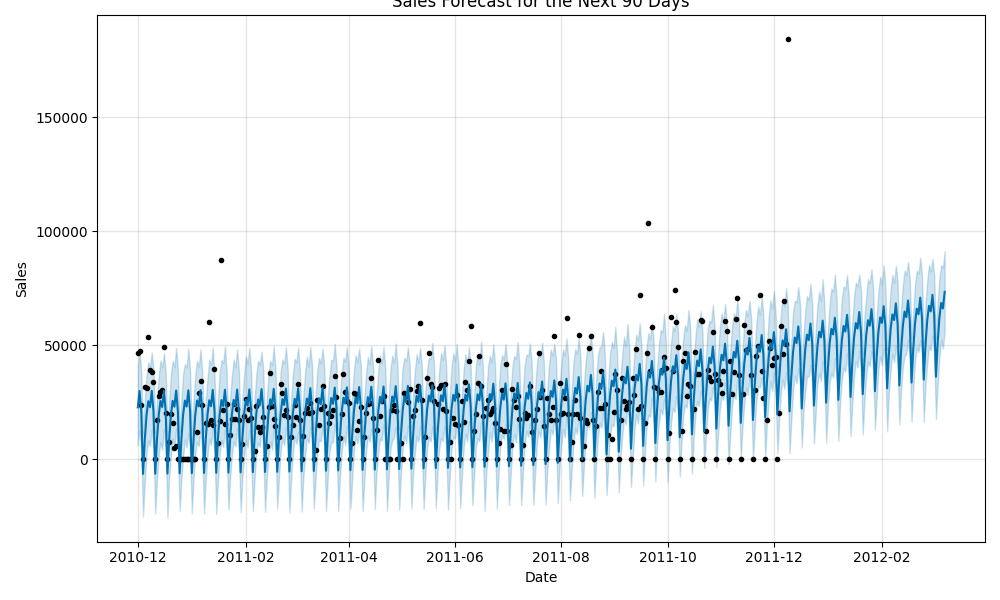

# AI-Sales-Forecaster
# 🚀 Next-Level AI Business Simulator

[](https://www.python.org/)
[](https://streamlit.io)
[](https://facebook.github.io/prophet/)
[](https://scikit-learn.org/)

An interactive web dashboard that uses a suite of AI models to forecast sales, analyze customer behavior, and simulate pricing strategies for an e-commerce business.



## 📖 Description

This project is a comprehensive AI Business Simulator designed to analyze e-commerce data and provide actionable business intelligence. It transforms raw, real-world transactional data into a multi-faceted, interactive dashboard built with Streamlit that helps businesses make strategic, data-driven decisions.

The application goes beyond simple historical analysis by leveraging a suite of advanced machine learning techniques to solve complex business problems. It serves as an all-in-one tool for a business manager to understand past performance, predict future outcomes, and model strategic decisions before implementing them.

## ✨ Key Features

This dashboard integrates several advanced AI modules to provide a holistic view of the business:

* **AI-Powered Sales Forecasting**: Utilizes Facebook's Prophet model for robust time series forecasting, predicting sales 90 days into the future.
* **Explainable AI (XAI)**: Breaks down the forecast into its core components (trend, weekly seasonality, yearly seasonality), making the model's predictions transparent and understandable.
* **Customer Segmentation**: Employs K-Means Clustering on RFM (Recency, Frequency, Monetary) data to automatically group customers into distinct segments based on their purchasing habits.
* **Dynamic Pricing Simulator**: Features a prescriptive analytics model that simulates how changes in price might affect sales volume and total revenue, helping to optimize pricing strategies.
* **Real-Time External Data Integration**: Enhances the forecasting model's accuracy by incorporating real-world public search interest data from Google Trends as an external regressor.

## 🛠️ Technology Stack

* **Core Language**: Python
* **Dashboard**: Streamlit
* **Data Manipulation**: pandas, numpy
* **Forecasting**: Prophet
* **Machine Learning**: scikit-learn (for K-Means Clustering and Regression)
* **Visualization**: Plotly, matplotlib
* **API Integration**: Pytrends (for Google Trends)

## ⚙️ How to Run Locally

To run this application on your local machine, follow these steps:

1.  **Clone the Repository**
    ```bash
    git clone [https://github.com/your-username/your-repository-name.git](https://github.com/your-username/your-repository-name.git)
    cd your-repository-name
    ```

2.  **Create a Virtual Environment** (Recommended)
    ```bash
    python3 -m venv venv
    source venv/bin/activate
    ```

3.  **Install Dependencies**
    ```bash
    pip install -r requirements.txt
    ```

4.  **Run the Streamlit Application**
    ```bash
    streamlit run dashboard.py
    ```
    The application will open in a new tab in your web browser.
4.  **Run the Streamlit Application**
    ```bash
    streamlit run dashboard.py
    ```
    The application will open in a new tab in your web browser.
